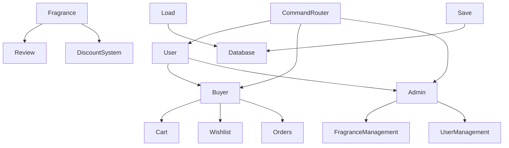
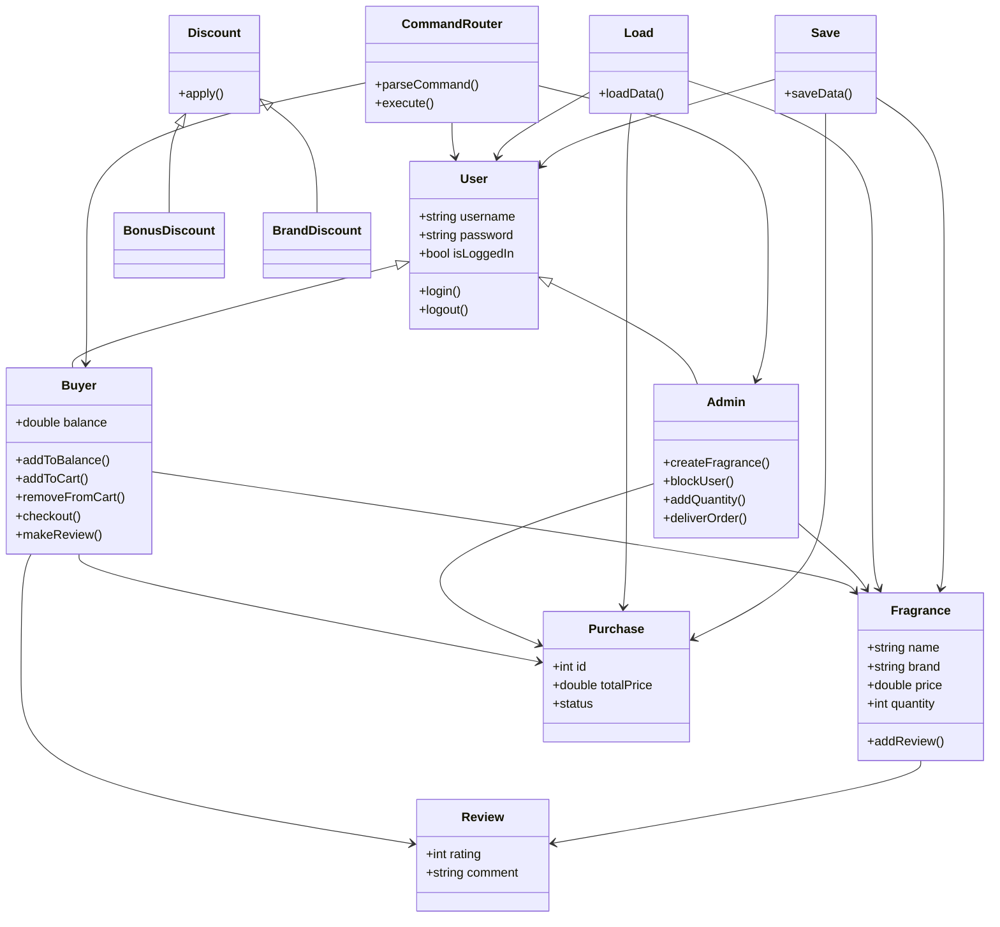

# NotinOOP — Fragrance Store Console Application

Course Project for Object-Oriented Programming (2025/2026)  
Faculty of Mathematics and Informatics, Sofia University "St. Kliment Ohridski"  
Software Engineering

---

## Table of Contents

- Overview
- System Architecture
- Features
- Buyer Features
- Administrator Features
- Discount System
- Commands
- Project Structure
- Technologies
- Data Persistence

---

## Features

### Buyer Features

- User registration and authentication
- Balance management (add funds)
- Shopping cart and wishlist management
- Intelligent product recommendations based on fragrance preferences
- Automatic selection and application of the best available discount voucher at checkout
- Review system for fragrances (0–5 star rating)
- Purchase history (all orders and delivered orders only)
- Cancel pending orders with full refund

---

### Administrator Features

- Create administrator accounts
- Block and permanently delete users
- Add new fragrances to the catalog
- Manage product stock levels
- Mark orders as delivered
- Moderate reviews (users with 7+ removed reviews are automatically blocked)

---

### Discount Vouchers

- Base Discount — percentage discount applied to all products
- Bonus Discount — percentage discount plus fixed bonus deduction
- Brand Discount — percentage discount applied only to specific brands

---
### General Commands

register <username> <password>
login <username> <password>
logout
list-fragrances
help
end (saves data and exits)

---

### Buyer Commands

- add-to-balance <amount>
- add-to-cart <name>
- remove-from-cart <name>
- view-cart
- add-to-wishlist <name>
- remove-from-wishlist <name>
- recommend
- checkout
- cancel <purchase-id>
- view-purchases
- view-bought
- make-review <fragrance-name> <rating> <comment>

---

### Administrator Commands

- create-admin <username> <password>
- block-user <username>
- create-fragrance <name> <brand> <price> <family>
- add-quantity <name> <quantity>
- deliver <purchase-id>
- remove-review <fragrance-id> <review-id>

---

## Notes

- All data is automatically saved when using the end command
- Data is restored automatically on startup from database.txt
- The application is fully console-based

---

## Technologies Used

- C++20
- Object-oriented programming
  - inheritance
  - polymorphism
  - encapsulation
  - abstraction
- STL (vector, string, algorithm, random)
- Rule of Five (manual memory management)
- File-based persistence system
- Modular architecture

---

## System Architecture

----

